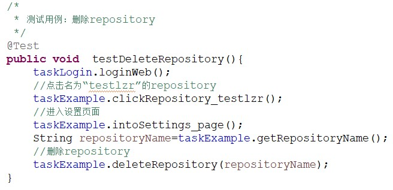

## 用java实现的一个web_UI层自动化测试框架

### 一、	框架图
 
 
### 二、	框架说明
web自动化框架基于selenium2 webDriver。在此基础上进行封装扩展，分三层架构：object、task、case。
1. Object层：提取web页面的元素对象
2. Task层：业务处理。
3. Case层：测试用例过程。

### 三、	支持的浏览器
 1.Firefox  
 2.Chrome  
 3.IE  
 4.HtmlUnit  

### 四、	搭建环境
把lib下的selenium-server-standalone-2.45.0.jar和web_auto_api.jar导入项目的path：
其中web_auto_api.jar是对selenium2 webDriver的封装扩展，详情见我的github另一个项目：https://github.com/Zongrong/web_auto_api

 ### 五、	编写自动化case
以gitHub新建repository和删除repository为例: 
#### 1. 修改config.properties文件

#### 2. 获取页面对象属性
	1>properties文件：在obj目录下的相应文件中记录页面元素的属性值。 比如xpath、id、name等信息。具体记录哪个属性值由case开发者决定。
 
#### 3. 业务处理
  在包test.task.XXX(其中XXX代表业务模块名,比如“login”表示登录模块
)下创建业务类，比如“LoginTasks.java” ： 
	a. 该类继承父类：TaskBase 
  b. 在构造方法中创建对象类的实例 
 
  c. 获取页面对象，并进行业务处理 

 
#### 4. case层
在包test.task.XXX(其中XXX代表业务模块名,比如“example”,这里表示这是一个举例的模块下创建业务类，比如“ExampleCases.java”: 
a. 该类继承父类：TestBase 
b. 如果有测试数据(在data目录下的properties文件)，要加载，并初始化。如果没有，可以不加载。 
 
	c.创建需要的业务类对象。 
  
	d.写case。case的方法上面要引用“@Test”标注 

 

支持的标注： 
	1>. @BeforeClass：所有case执行前执行 
  2>. @AfterClass：所有case执行后执行 
	3>. @Before：每一个case执行前执行 
	4>. @After：每一个case执行后执行 
	5>. @Parameters：case参数数据 
	6>. @Test：case用例 
      @Test(depends="xxx;yyy",parameter="DDD") 
`注意：为了业务处理和数据分离，所以建议把用例中用到的数据放在“data”目录的properties文件中。` 
 
e. case支持参数化 
	 1>.参数数据必须为类型为Object的二维数组，并用标注"@Parameters" 
   2>.case标注为"@Test(parameter="xxx") "，xxx为参数数据方法名 
 
f. case支持依赖：某case执行前，需要先执行其它case。 
   1>.用标注：@Test(depends="xxx")，xxx为依赖的case名，如果依赖多个case，case名用分号隔开。 
 
 #### 5. case写完后要把java文件路径放入test.cases.AllCases

### 六、	调试运行case
#### 1.调试单个case
在case 的java文件中 Run As -> Java Application 

  
#### 2. 运行所有case
在test.cases.AllCases中Run As -> Java Application 
 

### 七、	结果、日志
case运行完后会生成结果和日志文件 

